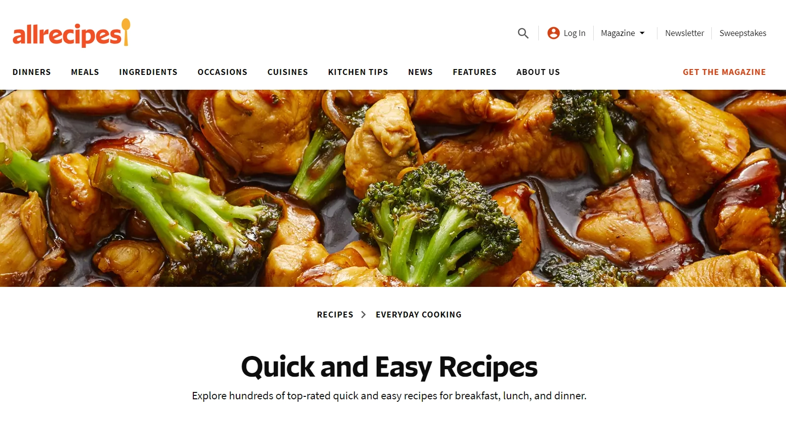

# Research performed for MyRecipe

There are 3 websites that I predominatly used for research.

## [BBC Good Food](https://www.bbcgoodfood.com/recipes)

Simple, bright design by a familiar brand in Britain.

**Pros**

* I like the simple navigation with the search bar always being easily accessible.
* The "Sign in | Register" buttons in the top-right make it obvious how to register for an account and login.
* The various categories at the top of the page.
* Recipes are instantly available, categorized by popularity, category, seasonal and so on.

**Cons**

* Very cluttered feeling, especially before closing the advert to "Download the app".
* I'm personally not a fan of the colour scheme, especially mixing green with pink.

## [allrecipes](https://www.allrecipes.com/recipes/1947/everyday-cooking/quick-and-easy/)

Another bright and simple design with a lot more whitespace.

**Pros**

* Consistent colour scheme.
* Login button in the top-right.
    * I am a fan of prioritising the login over registering, as you will likely signup only once on a website.
    * The ability to signup is on the login page which is intuitive for this choice.
* Instant recipes on the homepage.
    * Big images, nicely presented
* I love the "popular searches" feature of the search bar.
    
* I like that there are two ways to search (the navbar and further down the page).

**Cons**
* Search bar is quite low down on the homepage, however, there's also a second search icon in the nav.

## [Jamie Oliver's website](https://www.jamieoliver.com/)

This website is by a famous chef within the UK.

**Pros**

* Lovely colours and shading.
* Intuitive login/signup design in top-right.
* 5 stand out categories in the top navigation bar.
* I really like how the search functionality is a search icon that, when clicked, is a dropdown extension of the nav bar.

**Cons**
* Lack of contrast, between the white text and light-green background, isn't great for accessibility.
* Popup asking you to signup for his cookbook is obnoxious.
* One section with broken CSS.
    