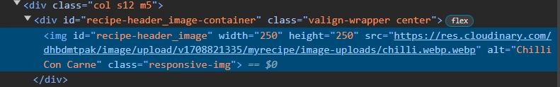

# **MyRecipe** - Milestone Project 3

"MyRecipe" is a place to discover new recipes, and share your own. You can also use other people's recipes as a template for creating your version.

This project demonstrates my ability to use Python, Flask, and SQLAlchemy. It also includes the use of Google's CSS framework "Materialize".
It builds on my knowledge gained from previous modules and showcases my skills in creating a website that incorporates database functionality.

<a href="https://my-recipe-project-3-0dce9d94a33a.herokuapp.com/" target="_blank">View the live project here.</a>


## User Experience (UX)

### Project Goals

The goal is to create a website where users can search for recipes and share their own.
A main feature is that users can use existing recipes as a template that they can modify to their liking.

It is preferred that modified recipes be private to the user. However, I decided to make them public for demonstration purposes.

The following are features that help MyRecipe users:
* Sticky ingredients list.
    * If the ingredients list scrolls out of view, it sticks to the top of the page.
* Dietary tags.
    * Each recipe has dietary tag icons.
    * Hovering over them reveals a tooltip for clarity to what it represents.
    * Recipes can be filtered by their tags by applying dietary filters when searching.

### User Stories

**As a first-time and recurring user**
1. I want to be able to easily search recipes with filters.
2. I want to be able to create my recipes.
3. I want to view all of my recipes.
4. I want to use other user's recipes as a template.
5. I want to be able to save/unsave recipes.
6. I want to view my saved recipes.
7. I want to be able to edit my recipes.

### Strategy Plane

#### User Goals

The target audience is aimed solely at anyone who likes to cook and modify recipes.
The goal is for users to be able to search for recipes and share their own. 

User goals:
1. Share, edit and delete their recipes
2. Copy a recipe as a template, with the original owner being credited.
3. Search for recipes using filters.

Site owner goals:
3. Generate traffic to the website through its users sharing recipes.
4. Successful website with an abundance of recipes.

#### Research

### Scope Plane

Features to include:
* Home page with a search bar and an unordered list of recipes underneath.
* A page for saved recipes.
* A page for your recipes, including ones you've taken and modified.
* A tag system where you can tag recipes with dietary metadata such as "vegan", "dairy-free", etc...
* Search functionality that includes the tag system to filter recipes.
* Ability to log in.

Possible features to include:
* Saved recipes
* Ratings

### Structure Plane

The homepage will include:

* Logo to the left
* Home 
* Login

After logging in, the Login button will be renamed to the user's username.
It will then have the following menu items:
* Profile
* My recipes
* Log out 
* About

Users will be able to click on "Add a Recipe" within the page "My Recipes".

The footer will contain a link to the About page and links to socials.

#### Research

Please find the research I conducted for this project [here](docs/research/research.md)

### Skeleton Plane

I have created my wireframe in Figma. To see the comments I've made, you will need to view the wireframe logged into an account such as a Google account.

You can find my [Figma wireframe design here](https://www.figma.com/file/g2XzHo2jGnEIlY4wayi499/MyRecipe)

For the mapping out the database structure, [I created an entity relationship diagram using Lucid.app](https://lucid.app/documents/view/b86f4c01-76f8-480c-be3f-36c04e2dae36)

* users 
    * User includes the Flask mixin UserMixin to manage users.
* recipes 
    * Contains 2 foreign keys:
        * User ID - The user who created the recipe as a foreign key.
        * Dietary tag ID - The ID of the dietary tags record associated with this recipe.
* saved_recipes
    * Contains 2 foreign keys:
        * Recipe ID
        * User ID
    * The combined foreign keys create a primary key for this table.
    * A primary key "ID" is added to future-proof the table. 
        * A primary key would be needed to properly index the table.
* modified_recipes
    * Contains 3 foreign keys:
        * User ID - The user who modified the recipe.
        * Recipe ID - The original recipe
        * Dietary tag ID - The ID of the dietary tags record associated with this recipe.
* dietary_tags
    * The ID is added as a foreign key to either a recipe or a modified recipe.

### Surface Plane

I want to have an attractive design that doesn't overwhelm the user. I will do this by adding lots of whitespace and not overcrowding pages with recipes.
I will use a simple and light colour scheme.

## Technologies Used

### Languages Used

* HTML5  
* CSS3
* Python

### Frameworks, Libraries & Programs Used

* Flask
    * Python web framework.
* Materialize CSS
    * Google's CSS framework.
* SQLAlchemy
    * A Python SQL relational database framework.
    * For creating and manipulating data within the Postgres database.
* Postgres
    * A database management system.
    * Used to store data, such as recipes, for MyRecipe within SQL tables.
* Hint.css
    * A pure CSS library for tooltips.
    * Used to label what each dietary icon means
* Pylance extension 
    * IntelliSense
    * Errors and warnings
    * Code navigation
    * Semantic colourization
* autopep8 extension/package
    * Package to automatically format to PEP8 standards.
* Pylint extension
    * GUI to validate my code against PEP8 standards.
    * Informs me of warnings, errors and formatting issues
* pycodestyle package
    * Commandline package for further validation to PEP8 standards.
* Bcrypt
    * Used to encrypt and validate passwords.
* Google Fonts
    * Easy access to many fonts supplied from a CDN that is close to the user, increasing download speed.
    * The @font-faces are in my stylesheet. This is quicker than the browser making two requests, the first being for the aforementioned stylesheet containing each @font-face.
* Font Awesome 
    * Professional icons
* Git 
    * Used for version control.
* GitHub
    * Used to store commits.
* Visual Studio Code
    * Used as the IDE for the project.
    * I set a shortcut for Visual Code to format HTML/CSS/JS (ctrl+shift+f).
* Paint.NET
    * Used to edit and create images for the project.
* Figma
    * Used to create the mockup of the website before developing.
* Word 
    * Used to present the project requirements in my own words, for project research, and brainstorming.
* Notepad and Notepad++
    * Used for quick notes from my mentor and for notes while developing.
    * Used for planning.
* Chrome - Inspect element
    * This was used to:
        * Style the website and test new ideas to be copied into the project.
        * Continuously test responsiveness by adjusting the screen size and by testing preset device dimensions.
        * Bug fix.
* Firefox, Microsoft Edge, Safari
    * Used to test compatibility on other browsers.
* [Responsinator](http://www.responsinator.com/) for testing on different screens.
* [Grammarly](https://app.grammarly.com/)
    * To help find and correct grammar and spelling mistakes.

## Testing

### [W3C Markup Validator](https://validator.w3.org)

* Common validator warnings.
    *  Section lacks heading.
        * I shoudn't be using section as there are no headings.
        * However, there are headings for each recipe within containers. 
        * In future, I would use a div instead.
    * hint.css warnings.
        * Possible misuse of aria-label.
        * aria-label is used for hint.css tooltip text.
* Common validator errors.
    * WTForms errors.
        * There are 13 errors created by the wtforms SelectMultipleFields.
        * In future, I would find a way to remove these but the project functions with them as they are bad attribute errors.

<details>
<summary>HTML validation results table</summary>

| URL                       | Page                 | Logged in | Comments            | Results                |
|---------------------------|----------------------|-----------|---------------------|------------------------|
| /                         | Homepage             | No        | hint.css warning    | [All passed apart from explained](https://validator.w3.org/nu/?doc=https%3A%2F%2Fmy-recipe-project-3-0dce9d94a33a.herokuapp.com%2F)|
| /                         | Homepage             | Yes       | WTForms errors.     | [All passed apart from explained](docs/validation/html/homepage_logged-in.webp) |
| /login                    | Log in               | No        | | [No errors or warnings](https://validator.w3.org/nu/?showsource=yes&showoutline=yes&doc=https%3A%2F%2Fmy-recipe-project-3-0dce9d94a33a.herokuapp.com%2Flogin)|
| /register                 | Register             | No        | | [No errors or warnings](https://validator.w3.org/nu/?showsource=yes&showoutline=yes&doc=https%3A%2F%2Fmy-recipe-project-3-0dce9d94a33a.herokuapp.com%2Fregister)|
| /my-recipes               | View user's recipes  | Yes       | | [No errors or warnings](docs/validation/html/my-recipes.webp)|
| /search?...               | Search results       | Yes       | WTForms errors. hint.css warning. | [All passed apart from explained](docs/validation/html/search-results-page_logged-in.webp)|
| /search?...               | Search results       | No        | hint.css warnings. Section lacks headings. Must change "/search%3Fsearch_bar=" to "/search?search_bar=" otherwise validator recieves 404. | [No errors](https://validator.w3.org/nu/?showsource=yes&doc=https%3A%2F%2Fmy-recipe-project-3-0dce9d94a33a.herokuapp.com%2Fsearch?search_bar%3D%26action%3D%26dietary_tags%3Dvv)|
| /recipe/4                 | View recipe          | No        | hint.css warnings | [No errors](https://validator.w3.org/nu/?showsource=yes&doc=https%3A%2F%2Fmy-recipe-project-3-0dce9d94a33a.herokuapp.com%2Frecipe%2F4)|
| /recipe/modified-recipe/2 | View modified recipe | No        | hint.css warnings | [No errors](https://validator.w3.org/nu/?showsource=yes&showoutline=yes&doc=https%3A%2F%2Fmy-recipe-project-3-0dce9d94a33a.herokuapp.com%2Fmodified-recipe%2F2)|
| /edit-recipe/             | Edit recipe          | Yes       | WTForms errors. hint.css warnings. | [All passed apart from explained](docs/validation/html/edit-recipe.webp)|
| /add-recipe               | Add recipe           | Yes       | WTForms errors. hint.css warnings. Also has an error for no src on the image but this is added through JS to show a preview of the uploaded image. | [All passed apart from explained](docs/validation/html/add-recipe.webp)|
| /add-modified-recipe/2    | Add modified recipe  | Yes       | WTForms errors. Duplicate ID error now resolved. | [No errors](docs/validation/html/add-modified-recipe.webp)|
| /profile                  | Profile              | Yes       | | [All passed](docs/validation/html/profile.webp)|
| /view-saved-recipes       | View saved recipes   | Yes       | | [All passed](docs/validation/html/view-saved-recipes.webp)|
   
</details>

### [W3C CSS Validator](https://jigsaw.w3.org/css-validator)

[No validation errors for style.css](https://jigsaw.w3.org/css-validator/validator?uri=https%3A%2F%2Fmy-recipe-project-3-0dce9d94a33a.herokuapp.com%2Fstatic%2Fcss%2Fstyle.css&profile=css3svg&usermedium=all&warning=1&vextwarning=&lang=en)

There are 2 warnings but that's because I am using a vendor extension for MateralizeCSS.

### [JSHint JavaScript Validator](https://jshint.com/)

* A common validation message is "M is undefined"
    * This is used by MaterializeCSS and will be defined at runtime.

<details>
<summary>JavaScript validation results</summary>

| JS filename                   | Results                                                                      |
|-------------------------------|------------------------------------------------------------------------------|
| base.js                       | Passed                                                                       |
| front-end-image-validation.js | Passed - After adding missing semi-colon and add let to variable declaration |
| init-materializecss-modal.js  | Passed                                                                       |
| init-select-field.js          | Passed                                                                       |
| load-preview-image-function.js| Passed - After adding missing semi-colon and removing one unnecessary semi-colon |

</details>

### Security features

* Flask_login is used to manage users.
    * This helps block users from pages where a login is required.
    * Manages users and allows me to authentucate them.
        * It's then decided whether the user is allowed to view certain pages or perform certain actions.
* User passwords are encrypted in SQL using Bcrypt.
* The admin is asked to change the default password if they haven't already.
* Validation of data is performed both at the front and back end.
* secure_filename is used on images to ensure the filename isn't malicious.

### PEP8 Validation

I used pylint and pycodestyle (formally known as pep8) to validate my Python code to PEP8 standards.
I also used autopep8 to quickly format my code first.

I decided to keep my line length at a cap of 100. This fits my project needs well and is the default for pylint.
I followed every other PEP8 guideline.

I used Google's doc string format for functions.

This is the output from pylint:


The import in the init file is unable to be added to the top.
This is due to routes using variables configured in the __init__ module.

There's also a line in the helpers module that is 2 characters over the line length limit.
This is due to a link attributing my knowledge of wtforms' SelectMultipleField to a Stackoverflow post.


### Testing User Stories From The User Experience Section

1. "I want to be able to easily search recipes with filters."
    * Search by search term.

        
    * Search by search term with filter.

        
    * Search by filter only.

        

2. "I want to be able to create my recipes."
    * Users can add new recipes by going to the "My Recipes" page under their account. Next, click "Add a new recipe".

        
    * The user will be brought to their newly created recipe.

        
3. "I want to view all of my recipes."
    * Users can view their recipes by clicking "My Recipes" under their account tab.

        
4. "I want to use other user's recipes as a template."
    * Any recipe the user doesn't own, will see the "Use as template" button when viewing a recipe.

        
    * They will be brought to a page to create a modified recipe.

        
5. "I want to be able to save/unsave recipes."
    * Users can click a button to save or unsave recipes when viewing a recipe.

        
6. "I want to view my saved recipes."
    * Users can view their saved recipes by clicking the link under their account tab.

        
7. "I want to be able to edit my recipes."
    * Users can edit their recipes by clicking "Edit" under the settings cog.

        
        

### Manual Testing

* I tested file formats on the image upload field when adding a new recipe.
    * I attempted uploading all the allowed formats to ensure they were successful.
    * I tested that invalid file formats were rejected in the back end and the front end.
* Tested that the backend validation works to ensure only the authorized users can delete.
    * I did this by editing the URL to try to delete recipes I don't own.
* I switched filesystem provider from Cloudcube s3 bucket to Cloudinary.
    * I needed to increase the size of the string column "image_url" to accommodate a longer URL.
    * I used the following SQL to alter the size of the column in the production and local database:
    ```
    ALTER TABLE recipes ALTER COLUMN image_url TYPE VARCHAR(300);
    ```
    * I edited a recipe and replaced a recipe image with the same image. 
        * I inspected the URL and saw that the URL was local. 
        * I remembered I hadn't yet set the environment variables in production.
        * After setting them, I edited the image again and inspected the URL. It was set to the intended Cloudinary URL:

            
* When testing the website on my phone.
    * I noticed that the "Saved recipes" nav item was misssing.
    * I created a macro to hold the nav items and added it to both mobile and desktop account items.
* I checked the console for each page.
    * There are sometimes serveral issues generated by MaterializeCSS. [More on this in known issues](#known-issuesbugs).
* Created a mashed potatoes recipe.
    * I then searched for the recipe with the search query "mashed potatoes".
        * I discovered that, due to spaces not being handle, the search query was "mashed+potatoes".

            
        * I fixed this by using .replace("+", " ") on the search_query within the search route.

            
    * I edited the recipe.
    * I uploaded an invalid image.

        
        * This caused the app to break when submitted.
        * I had forgotten ".html" on my template.
        * I also noticed the image url was still the invalid one.
        * I reset the form image url before rendering the template with the validation messages.
        * I forced validation to fail and tested this on a modified recipe.
* I checked to ensure search validation worked. By entering no filter **or** search term.

    
* I created a new modified recipe.
    * Checked it appeared under "My Recipes".
    * Edited every editable field.
    * Then deleted it.
* I tested the website on my mobile.
* I clicked all the links.
    * GitHub link opens a new tab because it's an external link.
* I had my partner test the website on their phone.
* I used Responsinator to double check how everything looks on different devices. 

#### Google Lighthouse

I accessed the different pages with Google Lighthouse while hosting the site locally.

The score bubbles are in the following order:

Performance - Accessibility - Best practices - SEO

**Mobile**

* Hompage

    

* View recipe

    

* Search results

    

**Desktop**

* Hompage

    
    
* View recipe

    

* Search results

    

### Known Issues/Bugs

* A user can save their recipes by editing the URL.
    * There's no backend code to stop you from doing this but it's also not a problem.
    * To stop this would mean querying the database an extra time before saving/unsaving recipes which isn't worth it. If someone wants to save their recipe by manually editing the url that's up to them.
* Can't save modified recipes.
    * Saved_Recipes contains the foreign key for only a standard Recipe.
    * Modified recipes should be private but for demonstration purposes, they are public.
* "A form field element should have an id or name attribute".
    * The dietary tag fields are created by wtforms.
* If there is a validation error when searching recipes, it returns to the homepage with the validation message.
    * It does this when searching using the search box on the search results page when it should return to the same page.
* For this release of the project, I'm unable to check if the image exists on Cloudinary and delete it.
    * This means there will be undeleted images.
    * Image deletion is handled if stored locally.
*  "field element should have an id or name attribute"
    * Violating nodes:
        * Dietary tag input with the placeholder "Add dietary filters".
        * All the dietary tags that are displayed as inputs by Materialize.
    * Materialize uses JavaScript to create the violating nodes from my select element.
    * The original select tag, that they're based off, have got ID and name attributes.
    * It is not possible to add the ID and name fields without doing so manually using JavaScript.


### Deployment

#### Deployment dependencies 

In order to deploy to Heroku, a Procfile and requirements.txt file is needed.

* The Procfile tells Heroku how to run the app.
* The requirements.txt file lists the dependecies needed to be installed for the project.

I have kept both these files **only** on the production branch. Both branches are identical apart from these two files.

#### Heroku

I deployed to Heroku using the following steps:

1. Create a production branch based on "main". The main branch will be merged into this branch to deploy to production.
2. On the production branch, run "pip3 freeze --local > requirements.txt" to create the requirements file.
3. On the production branch, add a UTF-8 encoded file, named "Procfile" with no extension.
    * Enter "web: python run.py" into the Procfile
4. On Heroku, add a new project.
5. Within the new project, go to the "Deploy" tab. 
6. Choose "GitHub" and connect the repo containing the project. Set the branch to "production".
7. Add all the environment variables.
    * IP
    * PORT
    * SECRET_KEY
    * DEBUG
    * DATABASE_URL
8. For this project, you will also have to set the variables for Cloudcube (An Amazon s3 bucket).
9. Under "More" in the top-right, click "Run Console".
10. Enter "python3".
11. Enter "from myrecipe import app, db, models"
12. Next enter "with app.app_context():"
13. Press enter and add a tab. Then enter "app.create_all()". This creates the tables needed from Models.py.
14. Click "Open App" to view the deployed project.

#### Forking the GitHub Repository

By forking the GitHub Repository we make a copy of the original repository on our GitHub account to view and/or make changes without affecting the original repository.

1. Log in to GitHub and locate the GitHub Repository.
2. At the top of the Repository just above the "Settings" Button on the menu, locate the "Fork" Button.
3. You should now have a copy of the original repository in your GitHub account.

#### Making a Local Clone

1. Log in to GitHub and locate the GitHub Repository.
2. Under the repository name, click "Clone or download".
3. To clone the repository using HTTPS, under "Clone with HTTPS", copy the link.
4. Open Git Bash.
5. Change the current working directory to the location where you want the cloned directory to be made.
6. Type `git clone`, and then paste the URL you copied in Step 3.

```
$ git clone https://github.com/avabellaw/my-recipe
```

7. Press Enter. Your local clone will be created.

```
$ git clone https://github.com/avabellaw/my-recipe
> Cloning into `CI-Clone`...
> remote: Counting objects: 10, done.
> remote: Compressing objects: 100% (8/8), done.
> remove: Total 10 (delta 1), reused 10 (delta 1)
> Unpacking objects: 100% (10/10), done.
```

[Click Here](https://help.github.com/en/github/creating-cloning-and-archiving-repositories/cloning-a-repository#cloning-a-repository-to-github-desktop) to retrieve pictures for some of the buttons and more detailed explanations of the above process.

## Credits

### Content

#### Recipes

* Chilli Con Carne
    * [Image from Unsplash by Micheile Henderson](https://unsplash.com/photos/red-and-green-chili-peppers-in-white-ceramic-bowl-FhMB8pMge5U)
    * [Content based on recipe by bbcgoodfood](https://www.bbcgoodfood.com/recipes/chilli-con-carne-recipe)
* Simple Pasta
    * [Image from Unsplash by Ben Lei](https://unsplash.com/photos/potato-fries-on-white-ceramic-plate-flFd8L7_B3g)
* Pizza
    [Image from Pixabay by igorovsyannykov](https://pixabay.com/photos/pizza-italian-homemade-cheese-3007395/)

### Code

* ["# type: ignore" will ignore errors](https://stackoverflow.com/questions/58936116/pycharm-warns-about-unexpected-arguments-for-sqlalchemy-user-model)
    * Otherwise there is an error for unexpected arguments when using models.
    * I avoided having to use this by changing linter configurations.
* [Registering users with Flask](https://www.youtube.com/watch?v=71EU8gnZqZQ)
    * I originally just inputted new users into the database.
    * I watched this video to learn about how to properly handle user registration in Flask.
    * Taught me how to encrypt and check the encrypted password.
    * Taught me how to keep track of whether the user is logged in within Flask using LoginManager. 

* bcrypt wasn't able to check_password "Invalid salt".
    * This is because Postgres already encodes the hash.
    * [I decode the hash to UTF-8 before adding](https://stackoverflow.com/questions/34548846/flask-bcrypt-valueerror-invalid-salt)

* flask_wtf 
    * [How to create forms](https://flask-wtf.readthedocs.io/en/1.2.x/quickstart/#creating-forms)
    * [wtforms validators](https://wtforms.readthedocs.io/en/3.0.x/validators/)

* [Add classes to flask_wtf form elements](https://stackoverflow.com/questions/22084886/add-a-css-class-to-a-field-in-wtform)

* I learnt how to handle file uploads from flask.palletspro9jects.com and flask-wtf.readthedocs.io
    * https://flask.palletsprojects.com/en/2.0.x/patterns/fileuploads/#uploading-files
    * https://flask-wtf.readthedocs.io/en/0.15.x/form/
    * I worked out how to point to the 'image-uploads' folder through [this Stackoverflow post](https://stackoverflow.com/questions/37901716/flask-uploads-ioerror-errno-2-no-such-file-or-directory)

### Media

#### Images

* Default image if not uploaded with the recipe.
    * [From Pixabay](https://www.pexels.com/photo/closeup-photography-of-sauteed-garlic-263022/)

* Footer icons.
    [GitHub SVG from FontAwesome](https://fontawesome.com/icons/github?f=brands&s=solid)

* Dietary icons
    * [Vegan icon from Flaticon by Pixel Perfect](https://www.flaticon.com/free-icon/vegetarian_723633?term=vegetarian&page=1&position=3&origin=tag&related_id=723633)
    * [Vegetarian icon from Freepik by Valeria](https://www.freepik.com/icon/lettuce_12114434#fromView=search&term=vegetarian+&track=ais&page=1&position=76&uuid=f94071d6-1b72-4559-b054-b4b8ecfc2af6)
    * [Gluten-free icon from Flaticon by Freepik](https://www.flaticon.com/free-icon/gluten-free_4807774?term=gluten+free&page=1&position=4&origin=search&related_id=4807774)
    * [Dairy-free icon from Freepik by bsd](https://www.freepik.com/icon/milk-free_12954588#fromView=search&term=dairy+free&track=ais&page=1&position=14&uuid=86065469-2655-4257-97b3-60711af88994)
    * [Nut-free icon from Freepik by Freepik](https://www.freepik.com/icon/fruit_652405#fromView=search&term=nut+free&track=ais&page=1&position=4&uuid=500039e3-cbd4-42b9-bfeb-2361c3d32dd2)
    * [Egg-free icon from Freepik by Freepik](https://www.freepik.com/icon/no-egg_1807571#fromView=search&term=egg+free&track=ais&page=1&position=3&uuid=ac4be750-70f5-4dd6-95ac-02f3ed3769c6)